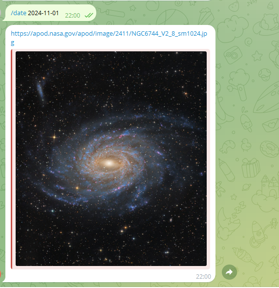

## Nasa app telegram bot

Install commands listing:  
```sh
qwuen@vm-c32d04:~$ ls
NasaApp-1.0.jar
qwuen@vm-c32d04:~$ sudo groupadd -r appmgr
qwuen@vm-c32d04:~$ sudo useradd -r -s /bin/false -g appmgr jvmapps
qwuen@vm-c32d04:~$ id jvmapps
uid=998(jvmapps) gid=999(appmgr) groups=999(appmgr)
qwuen@vm-c32d04:~$ sudo nano /etc/systemd/system/nasaapp.service
qwuen@vm-c32d04:~$ sudo chown -R jvmapps:appmgr /opt/prod
qwuen@vm-c32d04:~$ sudo mv NasaApp.jar /opt/prod/
qwuen@vm-c32d04:~$ ls /opt/prod/
NasaApp-1.0.jar
qwuen@vm-c32d04:~$ sudo systemctl daemon-reload
qwuen@vm-c32d04:~$ sudo systemctl start nasaapp.service
qwuen@vm-c32d04:~$ sudo systemctl status nasaapp.service
● nasaapp.service - Manage Java service
     Loaded: loaded (/etc/systemd/system/nasaapp.service; disabled; vendor preset: enabled)
     Active: active (running) since Sun 2024-11-03 18:19:31 UTC; 38min ago
   Main PID: 1143359 (java)
      Tasks: 22 (limit: 4647)
     Memory: 91.8M
        CPU: 6.611s
     CGroup: /system.slice/nasaapp.service
             └─1143359 /bin/java -Xms128m -Xmx256m -jar NasaApp.jar

Nov 03 18:19:31 vm-c32d04 systemd[1]: Started Manage Java service.
Nov 03 18:19:31 vm-c32d04 java[1143359]: SLF4J: Failed to load class "org.slf4j.impl.StaticLoggerBinder".
Nov 03 18:19:31 vm-c32d04 java[1143359]: SLF4J: Defaulting to no-operation (NOP) logger implementation
Nov 03 18:19:31 vm-c32d04 java[1143359]: SLF4J: See http://www.slf4j.org/codes.html#StaticLoggerBinder for further details.


```

Service unit:
```sh
[Unit]
Description=Manage Java service

[Service]
WorkingDirectory=/opt/prod
ExecStart=/bin/java -Xms128m -Xmx256m -jar NasaApp.jar
User=jvmapps
Type=simple
Restart=on-failure
RestartSec=10

[Install]
WantedBy=multi-user.target


```

Example image:  
